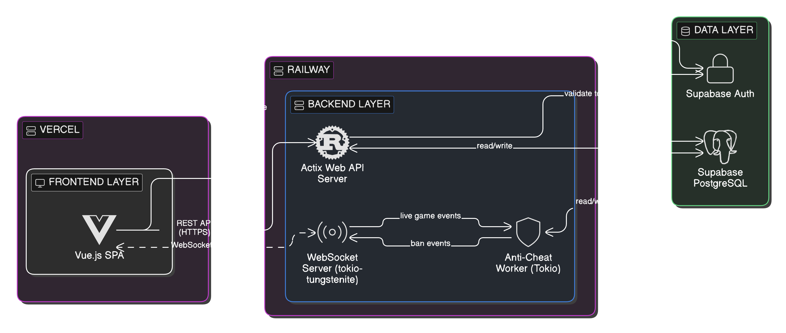

# Neuro

**Neuro** is a full-stack web application developed as a PROG3 course project. It features a high-performance Rust backend using Actix-Web for REST APIs and WebSocket connections, a modern Vue 3 frontend with TypeScript, and Supabase for database management and authentication. The application includes real-time game event handling and an anti-cheat system.

## Architecture



## Tech Stack

- **Backend:** Rust, Actix-Web, Tokio, tokio-tungtenite (WebSockets), Supabase (PostgreSQL + Auth)
- **Frontend:** Vue 3, TypeScript, Vite, Pinia
- **Tooling:** ESLint, OxLint, Prettier, Vitest

## Getting Started

### Prerequisites

- **Rust & Cargo** (latest stable version)
- **Node.js** (v18 or higher)

### Backend Setup

```bash
cd backend
cargo run
```

### Database Reset
To reset all tables, run the contents of `backend/src/supabase/schema.sql` in your Supabase dashboard under **SQL Editor > New Query**.

### Seed Game Assets
First, run `backend/src/supabase/schema.sql` in the Supabase SQL Editor to create the required database schema. Then run `backend/src/supabase/seed_game_assets.sql` in the Supabase SQL Editor. Replace `<project>` in the seed script with your Supabase project ID before running. This populates `asset_groups` and `game_assets` for both `gv` and `gf` games. Safe to re-run — it clears existing data first.

### Database Reset
To reset all tables, run the contents of `backend/src/supabase/schema.sql` in your Supabase dashboard under **SQL Editor > New Query**.

### Game Assets
Assets are stored in a public Supabase Storage bucket called `game-assets`.
```
game-assets/
├── gf/
│   └── group_00..09/
└── gv/
    └── group_00..09/
        ├── option_0.svg
        ├── option_1.svg
        ├── option_2.svg
        ├── option_3.svg
        └── reference.svg
```

Each group contains a reference image and four options. The public URL pattern is:
```
https://<project>.supabase.co/storage/v1/object/public/game-assets/<game_code>/<group>/<file>
```

### Frontend Setup

```bash
cd frontend
npm install
npm run dev
```

### Environment Variables

Create a `.env` file in the `backend` directory with the following variables:

```
SUPABASE_URL=your_supabase_url
SUPABASE_API_KEY=your_supabase_api_key
SUPABASE_ANON_KEY=your_supabase_anon_key
HOST=127.0.0.1
PORT=8080
ADMIN_API_ENABLED=true
```

## Testing
```bash
cd backend
cargo test
```

## Current Status

- ✅ Admin CRUD routes with env-based toggle (`ADMIN_API_ENABLED`)
- ✅ Backend API scaffolded with Actix-Web REST endpoints
- ✅ User authentication system implemented (register/login with JWT middleware)
- ✅ Frontend initialized with Vue 3, TypeScript, and Vite scaffolding
- ✅ WebSocket infrastructure for real-time communication
- ✅ Anti-cheat worker system architecture
