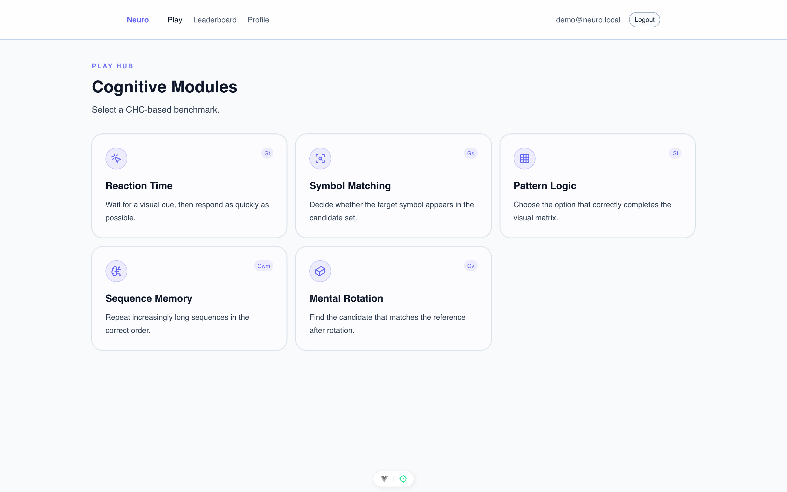

# neuro

> A web app that benchmarks human cognition across five tests and streams each round through a live anti-cheat pipeline over WebSockets.


neuro is a cognitive benchmarking platform built on a Rust/Actix-Web backend and a Vue 3 frontend. It administers five short tasks. Each task is modeled after an established paradigm from cognitive psychology and mapped to a broad ability factor in the Cattell-Horn-Carroll theory of intelligence. Every task targets a single narrow ability, so a session produces five separate scores instead of one composite number.

The backend records fine-grained per-round events, scores each session server-side, and persists results to Supabase (PostgreSQL plus Auth). During a session the frontend opens a WebSocket to the events endpoint, and the server evaluates each round against rules covering response timing, score patterns, and variance. A verdict comes back inline, either allowing the round, flagging it, or banning the player. Banned accounts are blocked at session start and routed to a dedicated page. Completed sessions feed per-game leaderboards and a per-player profile.

<p align="center">
  <br>
  <sub>The play hub, where a player selects one of the five benchmarks.</sub>
</p>

## Quickstart

```bash
git clone https://github.com/lambdaf-org/neuro
cd neuro

# backend (Rust/Actix-Web), serves on 127.0.0.1:8080 by default
cd backend
cargo run

# frontend (Vue 3/Vite), in a second terminal
cd frontend
npm install
npm run dev
```

The backend needs a Supabase project. Create a `.env` in `backend/` with the variables below, then apply `backend/src/supabase/schema.sql` and `backend/src/supabase/seed_game_assets.sql` in the Supabase SQL editor to create the tables and populate game metadata and assets. Image assets for the Pattern Logic (`gf`) and Mental Rotation (`gv`) tasks live in a public Supabase Storage bucket named `game-assets`. The Vite dev server proxies `/backend` to the Rust service on port 8080, so no extra frontend config is required for local development.

### Configuration

Backend variables (`backend/.env`):

| Variable | Required | Purpose |
| --- | --- | --- |
| `SUPABASE_URL` | Yes | Supabase project URL for the database and auth clients. |
| `SUPABASE_API_KEY` | Yes | Service API key used by the Supabase database client. |
| `SUPABASE_ANON_KEY` | Yes | Anon key used by the auth client for register and login. |
| `HOST` | No | Bind address (defaults to `127.0.0.1`; set `0.0.0.0` when deployed). |
| `PORT` | No | Bind port (defaults to `8080`; Railway supplies this automatically). |
| `ADMIN_API_ENABLED` | No | When set to `true`, mounts the `/admin` asset CRUD routes. |

Frontend variables (`frontend/.env.local`):

| Variable | Required | Purpose |
| --- | --- | --- |
| `VITE_ADMIN_UI` | No | When `true`, exposes the admin assets page in the UI. |
| `VITE_API_BASE_URL` | No | Public backend origin for a deployed frontend. Leave unset to use the Vite `/backend` proxy locally. |
| `VITE_WS_BASE_URL` | No | Explicit WebSocket origin. Derived from the API base URL when unset. |
| `VITE_BACKEND_ORIGIN` | No | Proxy target for the dev server (defaults to `http://127.0.0.1:8080`). |

## Features

- **Five CHC-mapped tests**: Reaction Time (Gt), Symbol Matching (Gs), Pattern Logic (Gf), Sequence Memory (Gwm), and Mental Rotation (Gv). Each maps to one broad ability factor and reports its own primary metric.
- **Real-time anti-cheat**: each round is streamed to the server over a WebSocket and checked by the rules in `backend/src/services/anticheat.rs`, which cover response timing, score patterns, and variance. The server replies with allow, flag, or ban. Two flags in a session force a ban, as does a sub-80ms reaction or five fast correct symbol-match trials.
- **Server-side scoring**: sessions finalize through a versioned scoring service that computes the metric for each game from the recorded trials, so clients do not report their own scores for the image-choice tasks.
- **Supabase persistence and auth**: register and login issue JWTs, an Actix middleware validates the bearer token (also accepted as a WebSocket query parameter), and the database holds results, sessions, and anti-cheat logs in PostgreSQL.
- **Leaderboards and profiles**: completed sessions populate per-game leaderboards, a player stats endpoint, and a profile page with recent sessions.
- **Admin asset management**: gated behind `ADMIN_API_ENABLED`, a set of `/admin` routes and an optional admin page manage asset groups and game assets for the image-based tests.

## How it works

A player signs in and picks a test from the play hub. The frontend calls `POST /api/game/{code}` to open a session; if the account is banned this is rejected up front. As the player works through rounds, the frontend opens `GET /api/game/session/{id}/events/ws` and sends each round (reaction time, correctness, client timestamp) over the socket. The server runs `evaluate_round` against the session history and returns an acknowledgement or an anti-cheat verdict; a ban routes the player to `/banned`. When the test ends, the frontend calls `PATCH /api/game/session/{id}` to finalize, and the scoring service computes the session metric and records it. The five primary metrics are:

| Code | Test | CHC | Primary metric | Direction |
| --- | --- | --- | --- | --- |
| `gt` | Reaction Time | Gt | Median reaction time (ms) | Lower |
| `gwm` | Sequence Memory | Gwm | Max sequence length | Higher |
| `gs` | Symbol Matching | Gs | Correct responses per time window | Higher |
| `gf` | Pattern Logic | Gf | Accuracy (percent) | Higher |
| `gv` | Mental Rotation | Gv | Accuracy (percent) | Higher |

The backend also serves an OpenAPI document and Swagger UI at `/swagger` for the REST endpoints.

## Contributing

See [lambdaf-org/contributing](https://github.com/lambdaf-org/contributing).

## License

No license yet; all rights reserved.